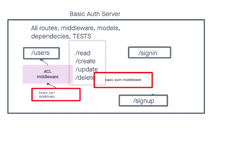

# LAB - Class 06

## Project: Express REST API with basic auth middleware

### Author: Malik Sadiki-Torres

### Problem Domain

Debug the server and get routes working
### Links and Resources

- [GitHub Actions ci/cd](https://github.com/MalikTorres/basic-auth)
- [back-end server](https://basic-auth-tm1k.onrender.com)

### Collaborators

I referenced Ryan Gallaways demo

### Setup

Install required dependecies and create postgre database

#### `.env` requirements (where applicable)

port variable exists within the env sample

#### How to initialize/run your application (where applicable)

clone repo, `npm i`, then run `nodemon` in the terminal. Then set up your postgres database

#### Routes

- POST: `/signin`
- POST: `/signup`

#### Tests

to run tests, after running `npm i`, run the command `npm test`

#### UML

